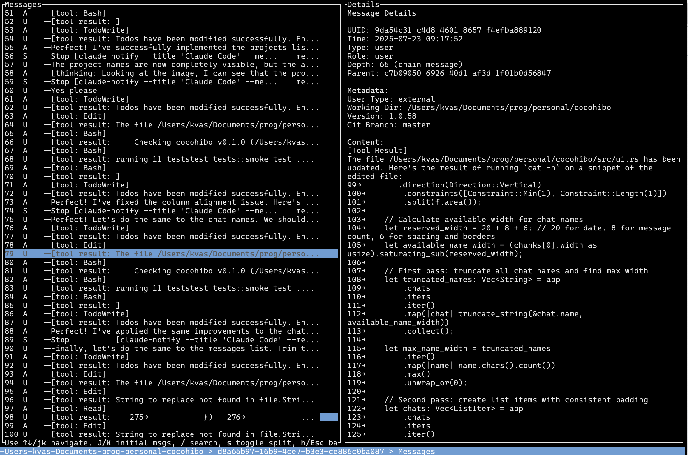

# Cocohibo

A terminal-based browser for Claude Code project history, built in Rust using Ratatui.

## Overview

Cocohibo allows you to explore and navigate through your Claude Code projects and chat histories in an intuitive terminal interface. It provides a hierarchical view of your projects, chats within those projects, and individual messages within each chat conversation.



## Features

- Browse Claude Code projects stored in `~/.claude/projects`
- Navigate through chats within each project
- View and search through message history
- Terminal-based interface with keyboard navigation
- Built using the ELM architecture pattern for clean state management

## Installation

### Prerequisites

- Rust (latest stable version)
- Cargo (comes with Rust)

### Building from source

1. Clone the repository:
   ```bash
   git clone <repository-url>
   cd cocohibo
   ```

2. Build the project:
   ```bash
   cargo build --release
   ```

3. Install the binary:
   ```bash
   cargo install --path .
   ```

## Usage

### Basic Usage

Run Cocohibo using either command:
```bash
cocohibo
# or the shorthand:
cch
```

### Command Line Options

```bash
cocohibo [OPTIONS]

Options:
  --projects-dir <PROJECTS_DIR>  Directory containing Claude Code projects
  --vertical-split               Use vertical split (up/down) instead of horizontal split
  -h, --help                     Print help
```

### Custom Projects Directory

By default, Cocohibo looks for Claude Code projects in `~/.claude/projects`. You can specify a different directory in three ways (in order of precedence):

1. **Command line argument**:
   ```bash
   cocohibo --projects-dir /path/to/your/projects
   ```

2. **Environment variable**:
   ```bash
   COCOHIBO_PROJECTS_DIR=/path/to/your/projects cocohibo
   ```

3. **Default**: `~/.claude/projects`

### Key Bindings

#### Navigation
- **↑/↓** or **j/k**: Move selection up/down
- **Enter** or **l**: Enter selected item (project → chats → messages)
- **Esc** or **h**: Go back to previous view
- **q**: Quit application
- **Ctrl+C**: Quit application

#### List Navigation
- **PgUp/PgDn**: Page up/down
- **Space**: Page down (Shift+Space for page up)
- **g**: Go to the first item
- **G**: Go to the last item
- **z**: Scroll the screen so that selected item is in the middle
- **t**: Scroll the screen so that selected item is at the top
- **b**: Scroll the screen so that selected item is at the bottom
- **/**: Enter search mode (type to search, press Enter to select, Esc to cancel)

#### Messages View Only
- **J**: Jump to next initial message
- **K**: Jump to previous initial message
- **s**: Toggle between horizontal and vertical split layout

## Architecture

Cocohibo follows the ELM architecture pattern:

- **Model**: Contains application state including current screen, projects list, selected project, chats list, and messages
- **Update**: Handles user input and updates the model accordingly  
- **View**: Renders the current state as a terminal UI

The application supports three main screens:
1. **Projects**: List of available Claude Code projects
2. **Chats**: List of chats within the selected project
3. **Messages**: Message history for the selected chat

## Dependencies

- `ratatui`: Terminal UI framework
- `crossterm`: Cross-platform terminal manipulation
- `serde`: Serialization framework
- `serde-jsonlines`: JSONL file handling
- `chrono`: Date and time handling
- `dirs`: Directory path utilities

## Development

To run in development mode:
```bash
cargo run
```

To run tests:
```bash
cargo test
```

## License

MIT License.
